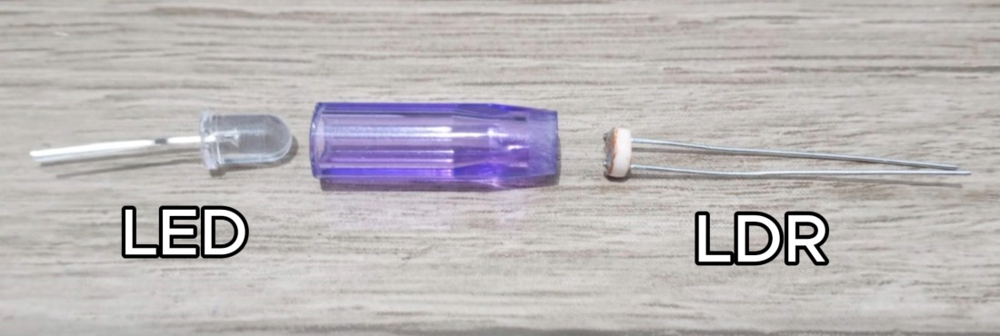
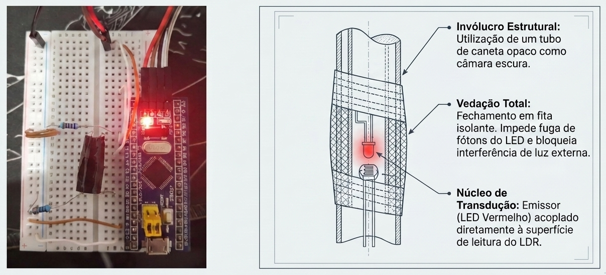

# Digipot STM32 — ADC, PWM, UART DMA e LUT

Implementação de um potenciômetro digital (*digital potentiometer*) utilizando um **LDR + LED** controlados por um microcontrolador STM32 Blue Pill. O projeto utiliza **ADC** para leitura da resistência equivalente, **PWM** para controle da intensidade luminosa do LED e **UART com DMA** para atualização dinâmica da tabela de calibração (*Look-Up Table*).


# Objetivo

O projeto implementa um *digipot* baseado em componentes discretos:

- Um **LED** controla a iluminação sobre um **LDR**;
- A resistência do LDR varia conforme a intensidade luminosa;
- O STM32 ajusta o brilho do LED via PWM;
- O valor da resistência é medido via ADC;
- Uma LUT (*Look-Up Table*) mapeia PWM ↔ Resistência equivalente

O sistema também permite:

- Recalibrar a LUT;
- Sobrescrever valores da LUT via UART utilizando DMA;
- Controlar uma resistência alvo digitalmente.

# Componentes do Hardware

- STM32 Blue Pill (STM32F103C8T6)
- LED e LDR acoplados (digipot)
- Resistores de 330Ω e 10kΩ

# Construção do Digipot
O digipot é construido de forma caseira, utilizando de um **LED** e de um **LDR** acoplados fisicamente e isolados da iluminação externa através do uso de fita isolante.





# Funcionalidades

## ADC — Leitura da resistência do LDR

O sistema utiliza o ADC (Pino PA0) para medir a tensão no divisor resistivo formado pelos seguintes componentes:

- resistor fixo de 10kΩ;
- LDR do digipot.

A resistência é calculada por:

```math
R_{LDR}=R_{FIXO}\left(\frac{4095}{ADC}-1\right)
```

Onde:

- `R_FIXO = 10kΩ
- `ADC` é o valor convertido (12 bits)


## PWM — Controle do LED

O brilho do LED é controlado via TIM3 PWM Channel 4 (Pino PB1)

O duty cycle altera a iluminação do LDR e consequentemente a resistência equivalente do sistema.


## Média móvel da resistência

Para reduzir ruído nas leituras do ADC, o sistema utiliza média móvel de 20 amostras para suavizar a leitura da resistência do LDR e garantir maior estabilidade do digipot.

## Look-Up Table (LUT)

A LUT armazena pares de valores de PWM e Resistência equivalente, permitindo a conversão rápida entre o controle do LED e a resistência medida.

```c
typedef struct {
    uint8_t pwm;
    float resistance;
} LutPoint;
```

A LUT é criada automaticamente durante a inicialização:

Processo:

1. O sistema varia o PWM do LED;
2. Mede a resistência do LDR;
3. Armazena os pontos na tabela;
4. Exibe os valores via UART.

Importante destacar que a relação PWM ↔ Resistência equivalente não é linear, sendo necessário o uso de interpolação para obter os valores intermediários da LUT e utilizar densidades de amostragem diferentes em regiões de maior variação, como mostrado no gráfico abaixo:

',data:[6640,3845,2847,2313,1987,1759,1593,1468,1365,1284,1021,883,793,729,681,642,611,586,564,545,529,514,502,491,480,469,462,454],borderColor:'rgb(54,+162,+235)',backgroundColor:'rgba(54,+162,+235,+0.1)',fill:true,tension:0.4,pointRadius:3}]},options:{title:{display:true,text:'Relação+PWM+x+Resistência+LDR'},scales:{xAxes:[{scaleLabel:{display:true,labelString:'Intensidade+PWM+'}}],yAxes:[{scaleLabel:{display:true,labelString:'Resistência+(Ohms)'}}]}}})

## Interpolação Linear

Quando o usuário solicita uma resistência alvo, o sistema calcula o PWM equivalente utilizando interpolação linear entre dois pontos da LUT.

```math
PWM=PWM_1+\frac{(R-R_1)(PWM_2-PWM_1)}{R_2-R_1}
```

## UART + DMA

O projeto implementa comunicação UART utilizando:

```text
HAL_UARTEx_ReceiveToIdle_DMA()
```

Benefícios:

- menor uso de CPU;
- recepção assíncrona;
- atualização dinâmica da LUT;
- alteração da resistência alvo em tempo real.

# Funcionamento do script

Ao iniciar, o script realiza a criação automática da LUT, mapeando os valores de PWM e resistência equivalente do LDR. 

Após essa calibração inicial, o sistema exibirá no terminal os valores de resistencia média medida atualmente no LDR do digipot, bem como a respectiva intensidade luminosa do LED (PWM) de 0 à 100%.

Além disso, o usuário pode realizar duas operações principais:

### Alterar resistência de saída

Formato de entrada via terminal serial:

```text
R <valor>
```

Exemplo:

```text
R 1500
```

O sistema:

1. busca o PWM equivalente;
2. aplica interpolação;
3. ajusta automaticamente o brilho do LED.

### Atualizar a tabela de LUT

Formato:

```text
L <indice> <pwm> <resistencia>
```

Exemplo:

```text
L 5 40 1200
```

Atualiza dinamicamente:

```text
LUT[5]
```

Caso o LED ou o LDR sejam substituídos, a LUT pode ser recalibrada através dessa funcionalidade.

# Testes Realizados

# RMSE (Root Mean Square Error)
Para comparar os valores de resistência de entrada e saída, foram selecionados 10 valores de teste:

',fill:false,tension:0.1}]},options:{title:{display:true,text:'Relação:+Resistência+Esperada+vs+Obtida'},scales:{xAxes:[{scaleLabel:{display:true,labelString:'Resistência+Esperada+(Ohms)'}}],yAxes:[{scaleLabel:{display:true,labelString:'Resistência+Obtida+(Ohms)'}}]}}})
---

A partir dos valores obtidos, o RMSE calculado foi de aproximadamente **70.09Ω**, indicando um erro médio de 70.09Ω entre os valores esperados e obtidos, o que é um resultado ok para um simples teste, porém que pode ser melhorado buscando mais precisão de leitura do ADC e utilizando maior densidade de amostragens para a LUT, por exemplo.

# Aplicação Exemplo

O digipot pode ser utilizado em:

- controle automático de ganho;
- ajuste de brilho;
- filtros analógicos;
- controle de sensores;
- circuitos de calibração.

# Vídeo Demonstrativo

[![Vídeo Demonstrativo]](https://drive.google.com/file/d/1bw9EpyrOs-MxHq6MxrjOZavRq2MME_Se/view?usp=sharing)